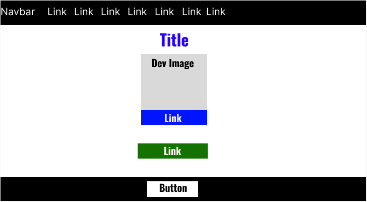

Hi 👋 My name is Manuel Mendes!
===============================

Student
----------

I've been learning coding since 2022, and have used C++ and Python.

## Hi there 👋

--------------------
## Overview

This is a site intended to share information about a particular developer.

Site Map:

- Home / Dev Page
- Blogs
- Projects
- Resources
- Live Site
- Github Repository
- Accessibility Check
- HTML Check

## Wireframe

Wireframe Image:



Link to Wireframe:
https://www.figma.com/design/ggjDE38FMqXbdeyc9cJCrj/wireframeDevPage?node-id=0-1&t=mA4uUnlI3MyPWvTL-1

## How to View
Link to Live Site: 
https://genovios.github.io/Genovios/

## Code Snippet

Code for Dev Card:

```
<div class="row">
		<div class="col-md-6 offset-md-3">
			<div class="card">
				<div class="card-header">
					<h4 class="card-title"> Dev Card </h4>
				</div>
				<div class="card" style="width:400px">
  					
  						<div class="card-body">
    						<h4 class="card-title">T, The Dev</h4>
    						<p class="card-text">
								Hi! I'm T, and this is my dev page! Feel free to use the Navbar
								above and take a look around the other linked pages!
							</p>
    						<a href="https://github.com/Genovios" class="btn btn-primary" target="_blank">
							  See Github Profile
							</a>
  						</div>
				</div>

				<div class="card-footer"></div>
					<a class="btn btn-primary" href="https://www.w3schools.com/bootstrap5/bootstrap_cards.php" target="blank"> 
						Learn how to make a Dev Card with BS5
					</a>
			</div>
		</div>
	</div>
```

## Attribution
### Resources for Assistance:
- Dr. Barry Cumbie: Brainstorming / Idea Assistance, Coding Assistance, Advice
- CIS Tutoring (Tutor Collaboration): JQuery, HTML ID and Class Tagging, Errors
- W3 Schools: JQuery, Image Editing, Text Editing, BS5 (Bootstrap 5)
- ChatGPT 5.1: Consultated for General Assitance, Code Creation, Code Editing
- Google AI: Consulted for Styling Assistance